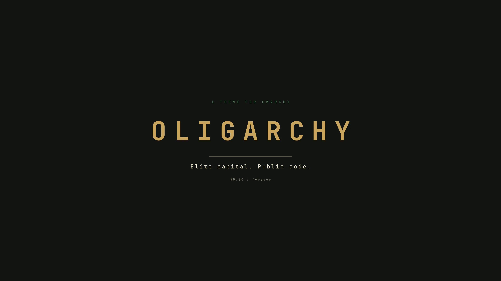

# Oligarchy

An [Omarchy](https://omarchy.org/) theme. Ink-black, champagne gold, racing green, oxblood.

> Elite capital. Public code.



## Install

```bash
omarchy theme install https://github.com/acrogenesis/omarchy-oligarchy-theme.git
```

That clones the repo into `~/.config/omarchy/themes/oligarchy` and applies it.

To switch to it later:

```bash
omarchy theme set oligarchy
```

Cycle wallpapers with `omarchy theme bg next`, or open the picker with `omarchy theme bg-switcher`.

## Update

```bash
omarchy theme update
```

## Remove

```bash
omarchy theme remove oligarchy
```

## GTK apps

Omarchy themes GTK apps by switching them to Adwaita-dark and setting an icon theme — it does not pass the palette along, so Nautilus and other GTK windows stay default grey. This theme ships a `gtk.css` that repaints them in the Oligarchy palette. Point GTK at the current theme's copy once:

```bash
mkdir -p ~/.config/gtk-3.0 ~/.config/gtk-4.0
ln -sfn ~/.local/state/omarchy/current/theme/gtk.css ~/.config/gtk-3.0/gtk.css
ln -sfn ~/.local/state/omarchy/current/theme/gtk.css ~/.config/gtk-4.0/gtk.css
```

Restart the apps to pick it up. The symlinks track whichever theme is applied.

## Backgrounds

| File | |
| --- | --- |
| `0-penguin.webp` | Crowned penguin. Free as in beer. Funded as in friends. |
| `1-library.webp` | Private library, green banker's lamp |
| `2-circuit.webp` | Empty night circuit after rain |
| `3-boardroom.webp` | Dark marble table, gold ring light |
| `4-figlet.webp` | `OLIGARCHY` in Omarchy's own logo font |
| `5-public-code.webp` | Elite capital. Public code. |
| `oligarchy.webp` | Centered wordmark |

Add your own without touching this repo: drop images into `~/.config/omarchy/backgrounds/oligarchy/`.

## Palette

| Role | Hex |
| --- | --- |
| Background | `#121410` |
| Dark background | `#0c0e0a` |
| Darker background | `#080907` |
| Lighter background | `#1c2118` |
| Foreground | `#e8dfc8` |
| Accent | `#c9a45c` |
| Selection | `#2a3424` |
| Muted | `#4a5240` |
| Red | `#b54a40` |
| Green | `#4e7a58` |
| Yellow | `#d4b46a` |

Icons: `Yaru-yellow`.

## License

Theme files are MIT (see `LICENSE`). The photographic wallpapers are AI-generated images, free to use and redistribute with the theme.
