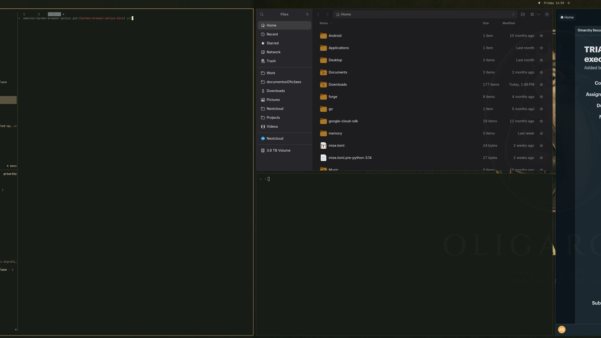
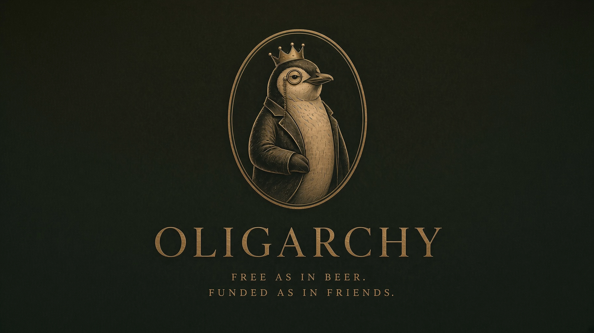

# Oligarchy

A dark olive and antique-gold theme for [Omarchy](https://omarchy.org/).

> Free as in beer. Funded as in friends.





## Install

```bash
omarchy theme install https://github.com/acrogenesis/omarchy-oligarchy-theme.git
```

```bash
omarchy theme set oligarchy
omarchy theme remove oligarchy
```

## Backgrounds

The crowned penguin is the wallpaper, in 16:9 plus 21:9 and 32:9 under `backgrounds/.responsive/0-penguin/`.

## Palette

| Role | Hex |
| --- | --- |
| Background | `#171c16` |
| Dark background | `#12160f` |
| Darker background | `#0c0f0a` |
| Lighter background | `#22281f` |
| Foreground | `#e8d9b4` |
| Accent | `#c7a668` |
| Selection | `#2c3226` |
| Muted | `#5a5440` |

Full ANSI palette in `colors.toml`. Icons are `Yaru-yellow`.

## GTK

Omarchy does not pass the palette to GTK apps. This theme ships `gtk.css`. Point GTK at the current theme once:

```bash
mkdir -p ~/.config/gtk-3.0 ~/.config/gtk-4.0
ln -sfn ~/.local/state/omarchy/current/theme/gtk.css ~/.config/gtk-3.0/gtk.css
ln -sfn ~/.local/state/omarchy/current/theme/gtk.css ~/.config/gtk-4.0/gtk.css
```

## License

MIT. Wallpapers are free to use with the theme.
